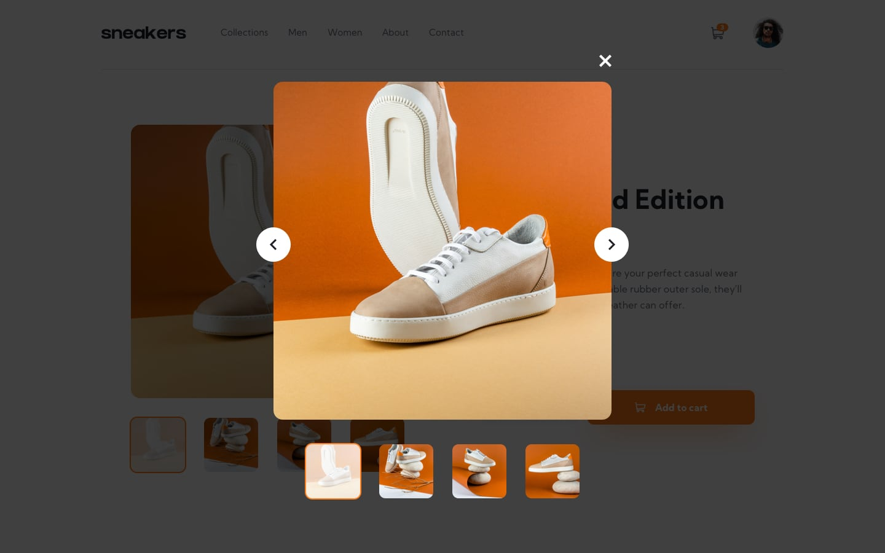

# Página de Producto de E-commerce

Este repositorio contiene una solución para el[E-commerce product page challenge on Frontend Mentor](https://www.frontendmentor.io/challenges/ecommerce-product-page-UPsZ9MJp6). 

## Tabla de Contenidos

- [Resumen](#Resumen)
  - [El Desafío](#El-Desafío)
  - [Capturas de Pantalla](#Capturas-de-Pantalla)
  - [Links](#links)
- [Mi Proceso](#Mi-Proceso)
  - [Construido Con](#Construido-Con)
  - [Lo Que Aprendí](#Lo-Que-Aprendí)
  - [Recursos Útiles](#Recursos-Útiles)
- [Authorr](#Author)
- [Acknowledgments](#acknowledgments)

### El Desafio

El desafío tenía como objetivo permitir a los usuarios:

- Ver el diseño óptimo del sitio según el tamaño de pantalla de su dispositivo.
- Experimentar estados de hover para todos los elementos interactivos en la página.

### Capturas de Pantalla

### Enlaces

Live Site URL: [Live site of the challenge hosted here](https://)
### Mi Proceso

### Construido Con

- HTML5
- Tailwind CSS 
- Typescript 
- React
- Redux/toolkit

### Lo Que Aprendí

Este desafío reforzó mi confianza en la creación de diseños utilizando Tailwind CSS para estilizar, y Redux Toolkit para manejar el estado de la aplicación de manera eficiente.

 
### Recursos Útiles
 [Frontend Mentor](https://www.frontendmentor.io) - Una plataforma para mejorar habilidades de front-end a través de desafíos.

## Autor

- Sitio Web - (Se actualizará una vez que cree mi portafolio)

## Agradecimientos

Quisiera expresar mi profundo agradecimiento a Frontend Mentor por proporcionar desafíos que no solo me desafían, sino que también me permiten mejorar mis habilidades de desarrollo front-end de manera significativa. Su plataforma ha sido una invaluable fuente de aprendizaje y crecimiento para mí.

Además, quiero agradecer a Nucba por brindar recursos y oportunidades de aprendizaje que han sido fundamentales en mi camino hacia la maestría en desarrollo web. Su compromiso con la educación de calidad y el apoyo a la comunidad de desarrolladores ha sido una inspiración constante para mí.

Sin el apoyo y los recursos proporcionados por estas increíbles plataformas y organizaciones, mi viaje de aprendizaje no habría sido posible. Estoy verdaderamente agradecido por su contribución a mi desarrollo profesional y personal.